# The Wickery

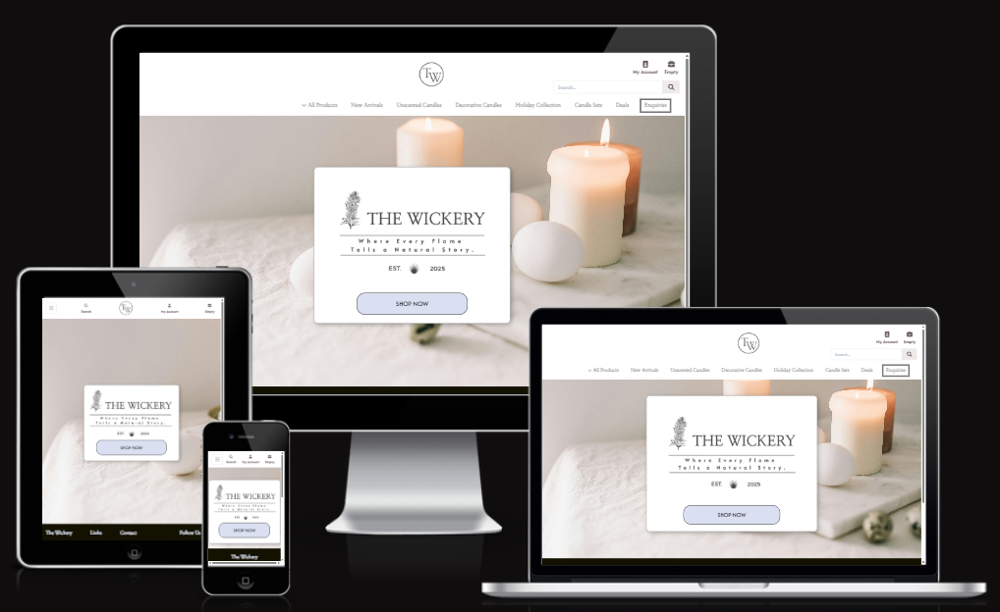

[View Live Website here.](https://the-wickery-d8e65af69641.herokuapp.com/)

[GitHub Repo](https://github.com/cajones93/the_wickery)

**Welcome to The Wickery**

**The Wickery** is your ultimate destination for handcrafted candles, designed to transform your space and elevate your senses. Explore a diverse range of candles featuring various wax types and captivating scents, each meticulously poured to bring warmth, ambiance, and delightful aromas into your home. Whether you're seeking a soothing lavender for relaxation, an invigorating citrus to uplift your mood, or a unique blend for a special occasion, The Wickery is the perfect place to discover your next favorite candle.

## CONTENTS

- [UX - User Experience](#ux)

  - [User Goals](#user-goals)
  - [Owner Goals](#owner-goals)
  - [Colour Scheme](#colour-scheme)
  - [Typography](#typography)
  - [Wireframes](#wireframes)
  - [Data Schema](#data-schema)
  - [User stories](#user-stories)

- [Features](#features)

  - [Index Page](#index-page)
  - [Posts Page](#posts-page)
  - [Post Detail Page](#post-detail)
  - [Add Post Page](#add-post-page)
  - [Edit Post Page](#edit-post-page)
  - [Delete Post Page](#delete-post-page)
  - [Edit Comment Page](#edit-comment-page)
  - [Delete Comment Page](#delete-comment-page)
  - [Sign Up Page](#sign-up-page)
  - [Log In Page](#log-in-page)
  - [Log Out Page](#log-out-page)
  - [Navbar](#navbar)
  - [Footer](#footer)
  - [Custom 404 Erro Page](#custom-404-page)
  - [Custom 500 Error Page](#custom-500-page)
  - [Features Left To Implement](#features-left-to-implement)


- [Testing](#testing)

- [Deployment & Local deployment](#deployment-&-Local-deployment)

  - [Deployment](#deployment)
  - [Local Deployment](#local-deployment)

- [Credits](#credits)
  - [Code](#code)
  - [Content](#content)
  - [Media](#media)
  - [Acknowledgments](#acknowledgments)

## UX

### User Goals

Users visiting The Wickery want to discover new candles that match their preferences. They'll want to easily search for candles that appear to them, select specific wax types or scents, find detailed information about each candle, and be able to contact the owner with questions, problems, and order enquiries.

### Owner Goals

The owner of The Wickery aims to build a thriving e-commerce destination for candle lovers. By offering a wide variety of high-quality candles, the owner can attract repeat customers and foster a community around candle appreciation. This will allow for direct sales, potential expansion into related products, and the opportunity to identify popular trends in the candle market.

### Colour Scheme

The Wickery's color scheme was generated using coolors.io. It aims to capture the essence of a clean, natural, and truly handmade candle experience. This palette is designed to make customers feel right at home. I used [WebAIM:Contrast Checker](https://webaim.org/resources/contrastchecker/) to check the contrast of my colours to ensure they are easy to read and meet accessibility standards.


### Typography

I used [Nanum Myeongjo](https://fonts.google.com/specimen/Nanum+Myeongjo) for my headers and titles and paired it with [Afacad](https://fonts.google.com/specimen/Afacad) for general text and readability. I found these fonts when creating my logo using logo.com and found they matched really well and gave the site a more professional feel.

### Wireframes

These were the original wireframe designs. During implementation, I deviated away from the original designs in favour of a more unique look.

#### Desktop
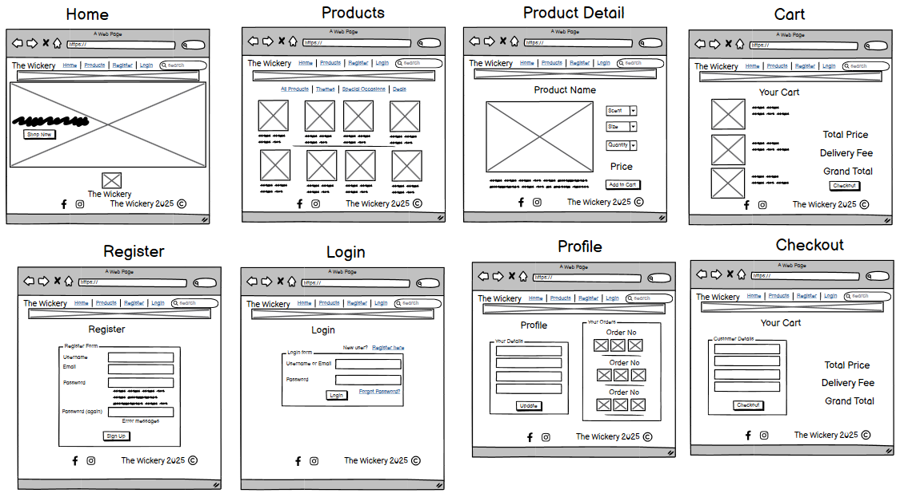

#### Mobile
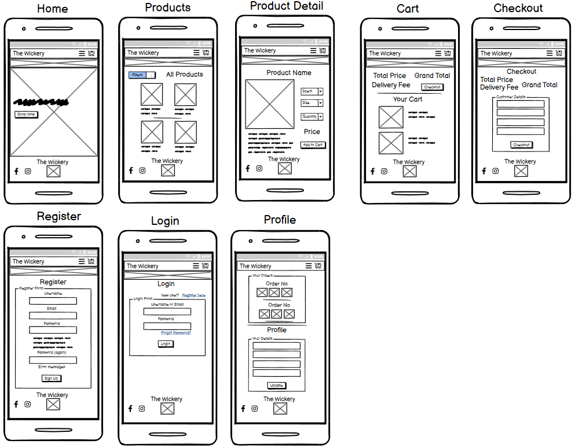

### Data Schema

My Data schema consists of 10 models described in the tables below:

### **1. Category**

**Purpose:** Stores different categories for products.

| Attribute Name | Type / Key | Description                         |
| :------------- | :--------- | :---------------------------------- |
| **id**           | PK, Int    | Unique identifier for the category. |
| **name**         | Char       | The name of the category (e.g., "Unscented Candles, Decorative Candles, Deals, Etc."). |
| **friendly_name**| Char       | A display-friendly name for the category. |

---

### **2. Product**

**Purpose:** Contains information about individual products.

| Attribute Name        | Type / Key  | Description                                        |
| :-------------------- | :---------- | :------------------------------------------------- |
| **id**                  | PK, Int     | Unique identifier for the product.                 |
| **name**                | Char        | The product's name.                                |
| **category**            | FK, Int     | Links to the **Category** table.                     |
| **sku**                 | Char        | Stock Keeping Unit, a unique inventory identifier. |
| **description**         | Char        | A detailed description of the product.             |
| **price**               | Decimal     | The base price of the product.                     |
| **image_url**           | URL         | URL pointing to the product's image.               |
| **image**               | Image       | The actual image file for the product.             |
| **available_wax_types** | ManyToMany  | Wax types available for this product (relates to **Wax**). |
| **has_scents**          | Boolean     | Indicates if the product has associated scents.    |
| **available_scents**    | ManyToMany  | Scents available for this product (relates to **Scent**). |
| **has_sizes**           | Boolean     | Indicates if the product has associated sizes.     |
| **available_sizes**     | ManyToMany  | Sizes available for this product (relates to **Size**). |
| **rating**              | Decimal     | The average rating of the product.                 |

---

### **3. Wax**

**Purpose:** Defines different types of wax available as product options.

| Attribute Name  | Type / Key | Description                                |
| :-------------- | :--------- | :----------------------------------------- |
| **id**            | PK, Int    | Unique identifier for the wax type.        |
| **name**          | Char       | The name of the wax type (e.g., "Soy Wax", "Beeswax", "Paraffin Wax"). |
| **friendly_name** | Char       | A display-friendly name for the wax type.  |
| **price_modifier**| Decimal    | A value to adjust the product price based on this wax type. |

---

### **4. Scent**

**Purpose:** Defines different scents available as product options.

| Attribute Name  | Type / Key | Description                            |
| :-------------- | :--------- | :------------------------------------- |
| **id**            | PK, Int    | Unique identifier for the scent.       |
| **name**          | Char       | The name of the scent (e.g., "Lavender", "Ocean Breeze", "Cinnamon", etc.). |
| **friendly_name** | Char       | A display-friendly name for the scent. |

---

### **5. Size**

**Purpose:** Defines different sizes available as product options.

| Attribute Name  | Type / Key | Description                                |
| :-------------- | :--------- | :----------------------------------------- |
| **size_id**       | PK, Int    | Unique identifier for the size.            |
| **name**          | Char       | The name of the size (e.g., "Small", "Medium", "Large", "Extra Large"). |
| **friendly_name** | Char       | A display-friendly name for the size.      |
| **price_modifier**| Decimal    | A value to adjust the product price based on this size. |

---

### **6. OrderLine Item**

**Purpose:** Represents a single product item within a customer's specific order.

| Attribute Name       | Type / Key | Description                                       |
| :------------------- | :--------- | :------------------------------------------------ |
| **id**                 | PK, Int    | Unique identifier for the order line item.        |
| **order_id**           | FK, Int    | Links to the **Order** table, indicating which order this item belongs to. |
| **product_id**         | FK, Int    | Links to the **Product** table, indicating the ordered product. |
| **selected_scent**     | Char       | The specific scent chosen for this product in the order. |
| **selected_size**      | Char       | The specific size chosen for this product in the order. |
| **selected_wax_type**  | Char       | The specific wax type chosen for this product in the order. |
| **quantity**           | Int        | The quantity of this specific product ordered.    |
| **lineitem_subtotal**  | Decimal    | The subtotal for this specific line item (quantity * base price * options price modifiers). |
| **lineitem_total**     | Decimal    | The total for this specific line item after any modifiers. |

---

### **7. Order**

**Purpose:** Stores details about a customer's order.

| Attribute Name     | Type / Key  | Description                                     |
| :----------------- | :---------- | :---------------------------------------------- |
| **id**               | PK, Int     | Unique identifier for the order.                |
| **order_number**     | Char        | A unique, human-readable order number.          |
| **user_profile**     | FK, Int     | Links to the **Profile** table (the user who placed the order). |
| **full_name**        | Char        | The full name of the person placing the order.  |
| **email**            | Email       | The email address associated with the order.    |
| **phone_number**     | Char        | The contact phone number for the order.         |
| **country**          | Country     | The country for the shipping address.           |
| **postcode**         | Char        | The postcode/zip code for the shipping address. |
| **town_or_city**     | Char        | The town or city for the shipping address.      |
| **street_address1**  | Char        | The first line of the street address.           |
| **street_address2**  | Char        | The second line of the street address.          |
| **date**             | Datetime    | The date and time the order was placed.         |
| **delivery_cost**    | Decimal     | The cost of shipping for the order.             |
| **order_total**      | Decimal     | The subtotal of all items in the order.         |
| **grand_total**      | Decimal     | The total cost of the order, including delivery. |
| **original_bag**     | Char        | Represents the original shopping cart contents. |
| **stripe_pid**       | Char        | The Stripe Payment Intent ID for payment processing. |

---

### **8. Enquiries**

**Purpose:** Stores customer enquiries.

| Attribute Name | Type / Key | Description                                    |
| :------------- | :--------- | :--------------------------------------------- |
| **id**           | PK, Int    | Unique identifier for the enquiry.             |
| **name**         | Char       | The name of the person making the enquiry.     |
| **email**        | Email      | The email address of the enquirer.             |
| **subject**      | Char       | The (optional) subject line of the enquiry.               |
| **message_type** | Char       | The type of message (e.g., "Report a problem", "General enquiries", "Bulk order"). |
| **order_number**    | Char   | The (optional) order number relating to the enquiry.   |
| **timestamp**    | Datetime   | The date and time the enquiry was submitted.   |
| **is_read**      | Boolean    | Indicates whether the enquiry has been read. |

---

### **9. Profile**

**Purpose:** Stores default details about a user, allowing them to autofill their checkout details.

| Attribute Name        | Type / Key | Description                                    |
| :-------------------- | :--------- | :--------------------------------------------- |
| **profile_id**          | PK, Int    | Unique identifier for the user profile.        |
| **user_id**             | FK, Int    | Links to the **UserAuth** table. |
| **default_first_name**| Char       | User's default first name.                   |
| **default_last_name**| Char       | User's default last name.                   |
| **default_phone_number**| Char       | User's default phone number.                   |
| **default_country**     | Char       | User's default country for shipping.           |
| **default_postcode**    | Char       | User's default postcode/zip code.              |
| **default_town_or_city**| Char       | User's default town or city.                   |
| **default_county**      | Char       | User's default county.                         |
| **default_street_address1**| Char       | User's default first line of street address.  |
| **default_street_address2**| Char       | User's default second line of street address. |

---

### **10. UserAuth**

**Purpose:** Manages user authentication details and basic account information using AllAuth.

| Attribute Name  | Type / Key | Description                                    |
| :-------------- | :--------- | :--------------------------------------------- |
| **id**            | PK, Int    | Unique identifier for the user account.        |
| **username**      | Char       | The user's unique username for login.          |
| **first_name**    | Char       | The user's first name.                         |
| **last_name**     | Char       | The user's last name.                          |
| **email**         | Email      | The user's email address.                      |
| **password**      | Char       | The user's password.                         |
| **is_superuser**  | Boolean    | Indicates if the user has superuser privileges. |

---

### **Relationships Summary:**

This section outlines the key relationships between the entities:

* **One-to-One:**
    * One **UserAuth** entry can have one **Profile** associated with it.

* **One-to-Many:**
    * One **Category** can have many **Product**s.
    * One **Order** can contain many **OrderLine Item**s.
    * One **Product** can appear in many **OrderLine Item**s.
    * One **Profile** (user) can place many **Order**s.

* **Many-to-Many:**
    * A **Product** can have multiple **Wax** types, and a **Wax** type can be available for multiple **Product**s.
    * A **Product** can have multiple **Scent**s, and a **Scent** can be available for multiple **Product**s.
    * A **Product** can have multiple **Size**s, and a **Size** can be available for multiple **Product**s.

[Lucidchart](https://www.lucidchart.com/) was used to create the ERD. The data is structured in an relational database. The ERD including primary and foreign keys is shown below.

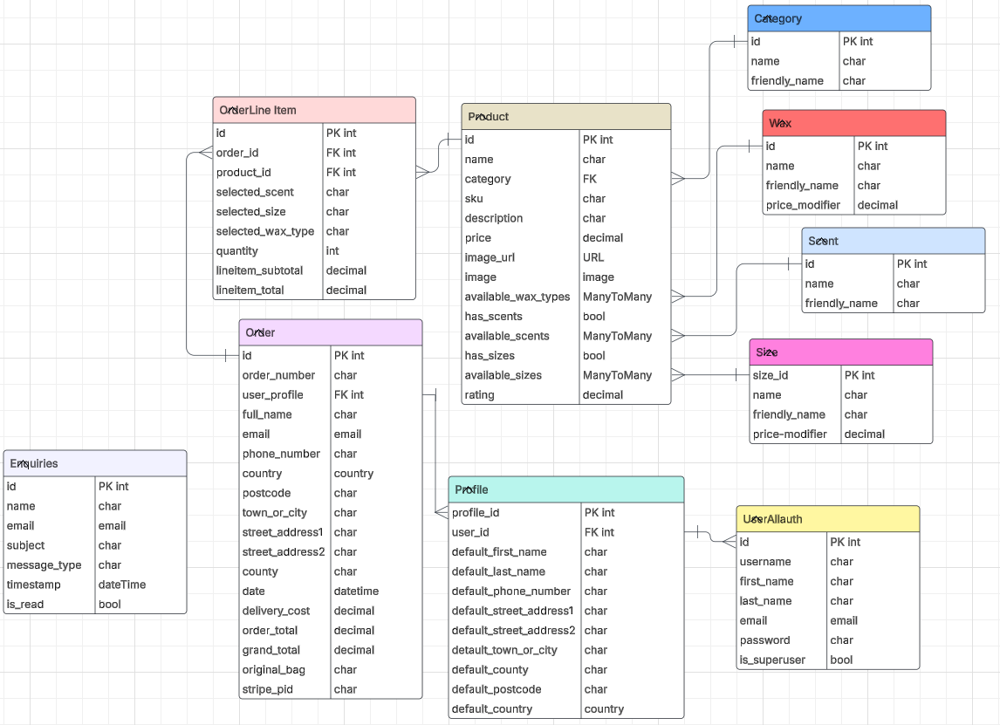

### User stories

I used Github project board and issues to keep track of my user stories and acceptance criteria while implementing the project:
[The Wickery Project Board](https://github.com/users/cajones93/projects/5)

1. As a new user I can sign up with a username and password so that I can create an account.
2. As a returning user I can log in securely so that I can access my account and see authorised features.
3. As a registered user, I can manage my shipping addresses in my profile so that future purchases are quicker and easier.
4. As a customer, I can browse candles by category so that I can easily find candles that match my preferences or needs.
5. As a customer, I can search for candles using keywords so that I can quickly locate specific products I'm interested in.
6. As a customer, I can view high-quality images and detailed descriptions for each candle, so that I can make informed decisions about my purchase.
7. As a customer, I can select different scent options for a candle product so that I can customize my purchase to my preference.
8. As a customer, I can select different size options for a candle product so that I can purchase the candle in my desired dimension or quantity.
9. As a customer, I can add candles to my shopping cart so that I can collect multiple items before proceeding to purchase.
10. As a customer, I can view all items currently in my shopping cart so that I can review my selections before proceeding to checkout.
11. As a customer, I can easily adjust quantities or remove items from my shopping cart so that I have control over my order before checkout.
12. As a customer, I can proceed to a secure checkout process so that I can confidently enter my shipping and payment information.
13. As a customer, I can pay for my order.
14. As a customer, I can receive an order confirmation so that I have a record of my purchase and next steps.
15. As a logged-in user I can view order history so that I can see my past order details.
16. As a customer I can visit the enquiries page so that I can leave a message for the site owner.

User Stories and Acceptance Criteria helped me to ensure each feature met the desired functionality and user experience.

## Features

### Home Page

- The Index Page was kept simple with a hero image and shop now button. The user clicks the shop now button to go to the products page. 

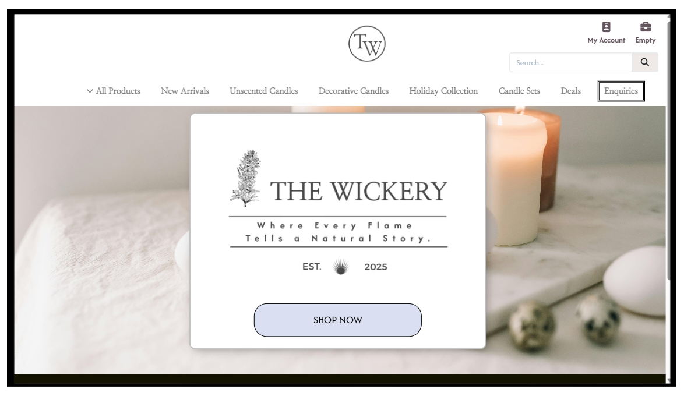


### Products Page

- The Products page shows all of the products available. A user can select a category from the nav bar and all items belonging to that category are displayed. The selected category is shown at the top (mobile) and on the left (desktop). Clicking the selected category removes the filter. The user can sort the products using the sort dropdown box. As for the products, the user is able to see a product image, product name, category, base price, and rating. Clicking the on the product takes the user to the Product Detail page.

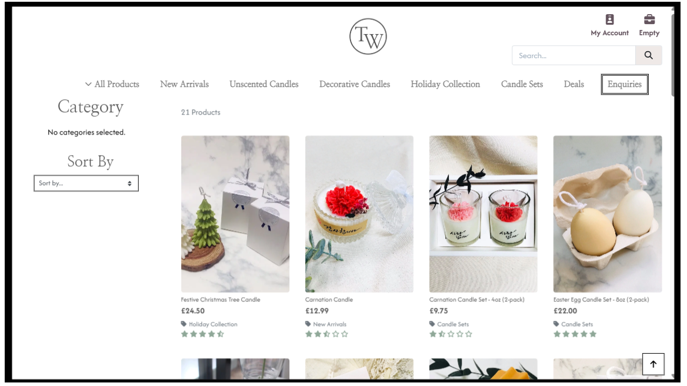

### Product Detail Page

- The Post Detail page shows the full information in the about the product. The user can see a large product image at the top (mobile) or on the left (desktop). Next they can see the product name, base price, category, and rating at the top. The user can see a detailed description about the candle. The three dropdown selections depends on the product. If a candle has sizes or scents available, they are shown those options. The user is also shown wax types that are available for the selected product. There is a quantity selector to allow a user to add multitple products to the bag. The total price is calculated whenever an option is changed so the user knows how much it will cost when they add it to their bag. There are validation checks in place for the quantity so the user cannot add more than 99 of a single product/options combination to the bag.


### Add Product Page

- A super-user can add a new product by navigating to the Product Management link which takes them to the Add Product Page. This page contains a form where the user inputs the information about the product. Required fields are noted with a (*). The has scents and has sizes fields expand to show available sizes and scents if they are selected. Validation ensures that at least one available scent/size is selected when has scents/sizes are checked. 

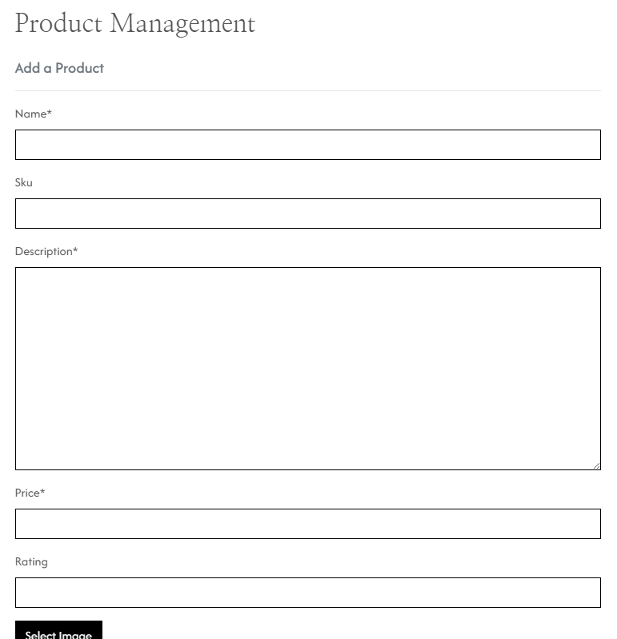

- If a user is not logged-in, they are redirected to the login page.

### Edit Product Page

- The Edit Post Page looks identical to the new product page. When a super-user clicks the edit button on a product, they are redirected to this page. The information is automatically populated so the user can make changes. Once the user submits their changes, they are redirected back to that product's product detail page and an alert is shown to say the update was successful.

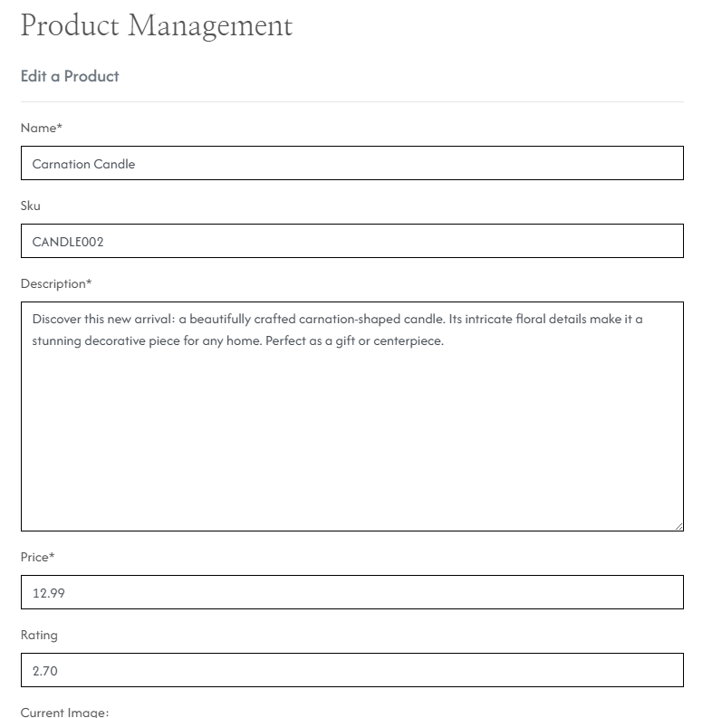

### Sign Up Page

- When a user clicks the Register link under the My Account navbar item, they are taken to the Sign Up Page. A user must input a valid email, username, password, and password confirmation. An email is sent to the user to confirm their email address. If the password is not valid, a message is displayed to the user.


### Log In Page

- The Log In Page allows a user to sign in using their username or email and their password. Upon successful log in, an alert is displayed to notify the user.

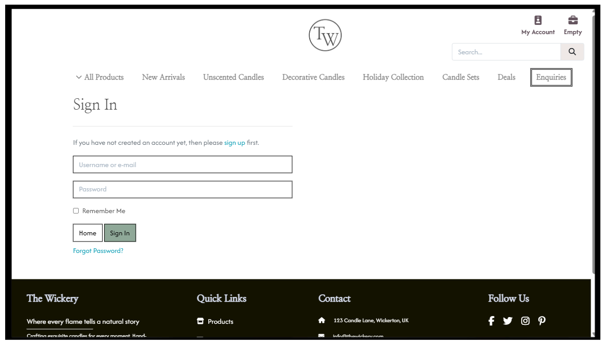

### Log Out Page

- The Log Out Page is a simple confirmation page asking the user if they really want to sign out. An alert is displayed when redirected to notify the user.


### Enquiries Page
- The Enquiries page allows a customer to send a message to the site owner. They can enter their name, email, type of enquiry, subject and body. This form is saved in the database and can be viewed in the admin page. If the user is logged in, the name and email address fields are auto-filled from the profile default details. If a user selects "report a problem" the order number is required. If they select "other" the order number is optional. If the user comes to the enquiries page through the "something wrong?" button on the checkout-success page, the message type is automatically set to report a problem and the order number if auto-filled. The user receives an alert letting them know that their enquiry has been submitted and an error when the form is invalid.


### Shopping Bag
- The shopping bag shows all products that have been added to the bag. The customer can make changes to their bag by editing the quantity and clicking the update button or by removing a product from the bag. Validation is in place to stop the quantity going over 99 and if a user submits a quantity of 0, the item is removed from the bag. There are alerts in place for when a user makes any changes to the bag. The customer can see a breakdown of their order summary showing the bag total, delivery cost, and grand total. From this page, the customer can proceed to a secure checkout of keep shopping using the navigation buttons.

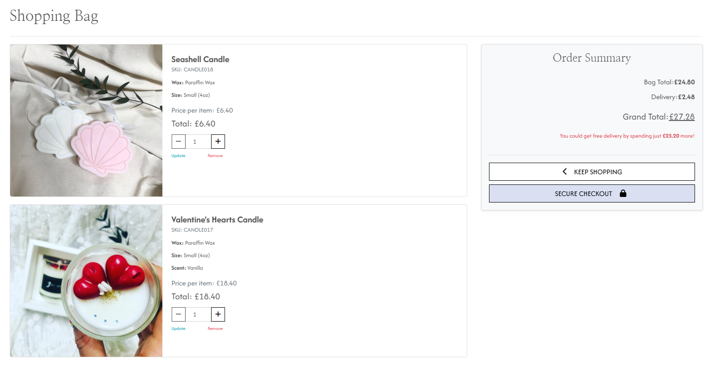


### Shopping Bag Preview
- When a new product is added to the bag or another action that triggers a message is performed, the customer is able to see the bag preview in the top right corner of the screen. This preview shows a small image and brief details about their order. It lets them know how much more to spend for free delivery and shows the grand total. The customer can click to go to  the checkout page.

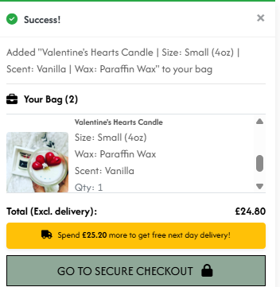

### Checkout Page
- The checkout page shows a summary of all products that are in the customer's bag. The summary is broken down showing a subtotal for each product, the order total, delivery cost, and grand total. There is a customer details form for the customer to fill out with delivery information. If the customer is logged in, the customer details will be automatically filled with their default delivery information. There is validation in place for required customer information and stripe checkout functionality. From this page, the user can go back to their back or complete the order.


### Checkout success page
- The checkout success page is shown once a customer successfully checks out. The customer is given their order number and told they have been sent an email with details about their order. The page shows information about the customer's order. When a customer visits this page from their profile page, an alert is shown telling them that this is a past order confirmation and displays a 'back to profile' button.

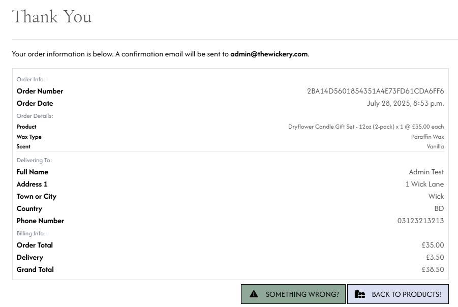
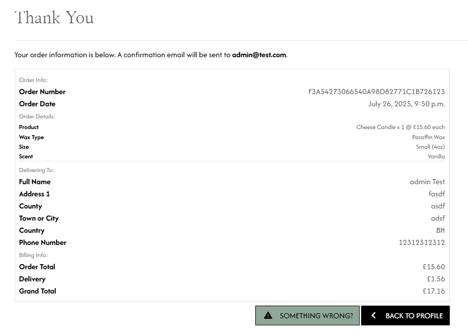

### Checkout Email
- On a successful checkout, the customer will receive an email including their order number, details, etc.

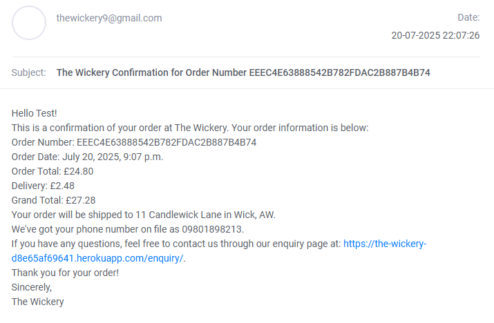

### Profile Page
- The profile page contains the customer's default delivery information which can be edited by changing the information and clicking the 'update information' button. This page also displays the order history for the logged-in customer. This order history information is brief and shows the first 5 characters of the order number, data, items, and order total. A customer can click the order number to go to that order's checkout success page.

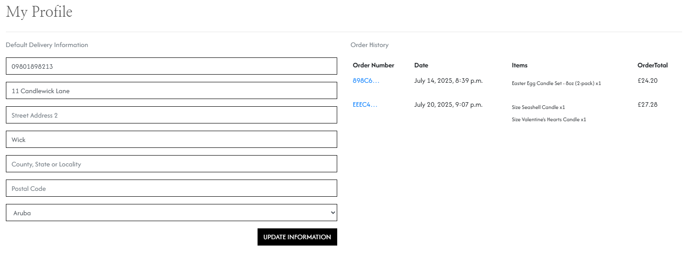

### Privacy Policy
- The Privacy Policy page shows a privacy policy generated from [Privacy Policy Generator](https://www.termsfeed.com/privacy-policy-generator/) to comply with privacy laws and GDPR.

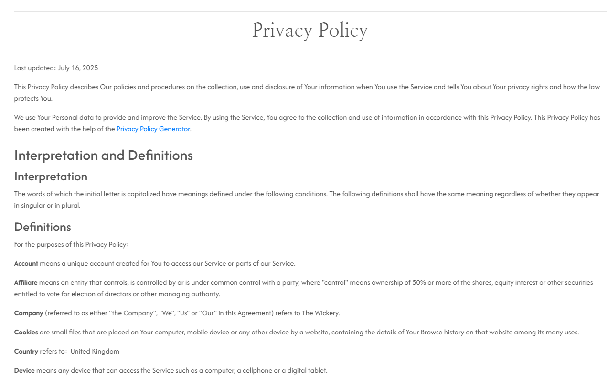

### Navbar

- The Navbar has 3 distinct sizes - mobile, tablet, desktop. The Navbar contains the brand logo, navigation elements, search bar, and category selections. On larger screens, the elements are spread out along the top of the page with the small logo in the center. On tablet-sized screens, the category names are condensed and the small logo is still displayed. On large mobile-sized screens, the elements are condensed into an accordion button which extends downwards when clicked to save space but the small logo is still displayed. On small mobile-sized screens, the logo is removed to save more space.


### Footer

- The Footer Section includes quick links to access different parts of the site, contact information, social media sites, and accepted payment methods.
  The social media links are shown in the icon and when users click on them, they will open in a new tab which makes it easy for the users to keep connected via social media.


### Custom 404 Error Page

- The Custom 404 Page is a simple page designed to guide the user back to the Home page or the products page. The user is automatically redirected to this page when they enter an invalid URL.

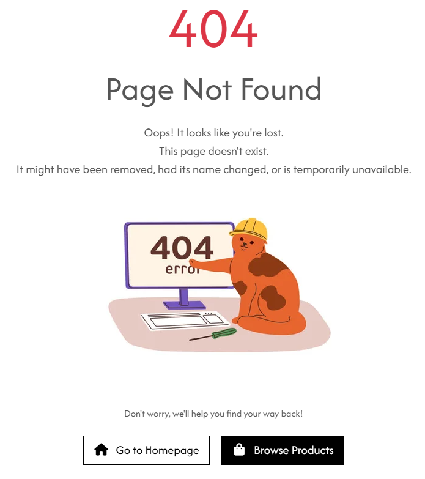

### Custom 500 Error Page

- The Custom 500 Page is a simple page designed to guide the user back to the Home page or the products page. The user is automatically redirected to this page when they experience a 500 internal error.

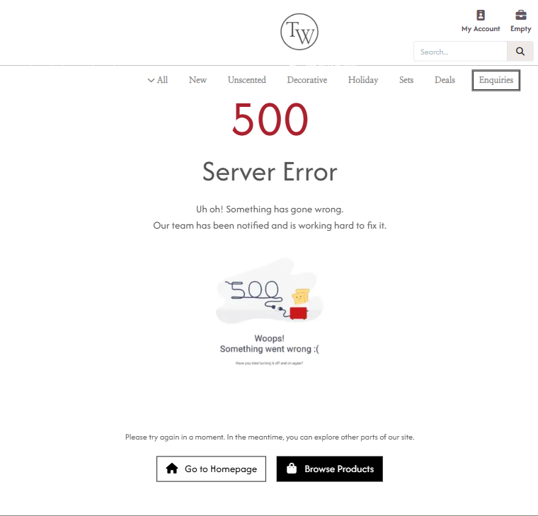

### Features left to implement

- Multiple categories. It would be nice for a user to add multiple categories when browsing the site. There was not enough time to implement this change and it would require changing how I implemented the category system.
- Giftwrap options. I originally wanted to add a giftwrap option on the checkout page. There was not enough time to implement as it requires a lot of changes to the stripe integration and payment processing.
- A tracking feature for users to track their order once submitted.
- Billing address / Shipping address information. At the moment, the user can only enter shipping details and is assumed to have the same billing and shipping address. It would be better to allow a user to have different billing and shipping addresses.

## Testing

For all testing, please refer to the [TESTING.md](TESTING.md) file.

## Deployment & Local Deployment

### Deployment

The Live deployed application can be found deployed on [Heroku](https://fitspace-routines-b98f037ee6fe.herokuapp.com/).

### Database

This project uses [Neon.tech](https://www.neon.tech) for the PostgreSQL Database. This was provided by Code Institute via a database-maker website for Code Institute Students.


### Local Deployment

This project can be cloned or forked in order to make a local copy on your own system.
For either method, you will need to install any applicable packages found within the _requirements.txt_ file.

- `pip install -r requirements.txt`.

You will need to create a new file called `env.py` at the root-level,
and include the same environment variables listed above from the Heroku deployment steps.

Sample `env.py` file:

```python
import os

os.environ.setdefault("DATABASE_URL", "user's own value")
os.environ.setdefault("SECRET_KEY", "user's own value")

# local environment only (do not include these in production/deployment!)
os.environ.setdefault("DEBUG", "True")
```

Once the project is cloned or forked, in order to run it locally, you'll need to follow these steps:

- Start the Django app: `python manage.py runserver`
- Stop the app once it's loaded: `CTRL+C` or `⌘+C` (Mac)
- Make any necessary migrations: `python manage.py makemigrations`
- Migrate the data to the database: `python manage.py migrate`
- Create a superuser: `python manage.py createsuperuser`
- Load fixtures (if applicable): `python manage.py loaddata file-name.json` (repeat for each file)
- Everything should be ready now, so run the Django app again: `python manage.py runserver`

### Heroku Deployment

The application was deployed to Heroku. In order to deploy, the following steps were taken:

1. If you have an account, login to Heroku. Otherwise create a new account.
2. Once signed in, click the "New" button in the top right corner, below the header and choose "Create new app".
3. Choose a unique name for the application and select your region. When done, click "Create app".
4. This brings you to the "Deploy" tab. From here, click the "Settings" tab and scroll down to the "Config Vars" section and click on "Reveal Config Vars" and set your environment variables.

| Key                     | Value                                                                |
| ----------------------- | -------------------------------------------------------------------- |
| `DATABASE_URL`          | user's own value                                                     |
| `DISABLE_COLLECTSTATIC` | 1 (_this is temporary, and can be removed for the final deployment_) |
| `SECRET_KEY`            | user's own value                                                     |

Heroku needs two (and one optional) additional files in order to deploy:

- requirements.txt
- Procfile
- .python-version

You can install this project's **requirements** (where applicable) using:

- `pip install -r requirements.txt`

If you have your own packages that have been installed, then the requirements file needs updated using:

- `pip freeze --local > requirements.txt`

The **Procfile** can be created with the following command:

- `echo web: gunicorn app_name.wsgi > Procfile`
- _replace **app_name** with the name of your primary Django app name; the folder where settings.py is located_

For Heroku deployment, follow these steps to connect your own GitHub repository to the newly created app:

Either:

- Select **Automatic Deployment** from the Heroku app.

Or:

- In the Terminal/CLI, connect to Heroku using this command: `heroku login -i`
- Set the remote for Heroku: `heroku git:remote -a app_name` (replace _app_name_ with your app name)
- After performing the standard Git `add`, `commit`, and `push` to GitHub, you can now type:
  - `git push heroku main`

The project should now be connected and deployed to Heroku!

## Credits

### Code

- The general foundation of the site was created by following the Code Institute Boutique Ado walkthrough and heavily modified.
- Capitalise the first letter: [StackOverflow](https://stackoverflow.com/questions/14268342/make-the-first-letter-uppercase-inside-a-django-template)
- Filter horizontally: [StackOverflow](https://stackoverflow.com/questions/22968631/how-to-filter-filter-horizontal-in-django-admin)
- Validators: [Django Documentation](https://docs.djangoproject.com/en/5.2/ref/validators/)
- DOMcontentloaded event: [Mozilla Documentation](https://developer.mozilla.org/en-US/docs/Web/API/Document/DOMContentLoaded_event)
- forloop.last: [StackOverflow](https://stackoverflow.com/questions/6998366/django-templates-forloop-first-and-forloop-last)
- clean(): [Django Documentation](https://docs.djangoproject.com/en/5.2/ref/forms/validation/)
- .prop(): [jQuery Documentation](https://api.jquery.com/prop/)
- .slideDown(): [jQuery Documentation](https://api.jquery.com/slideDown/)
- Tel Pattern attribute: [Mozilla Documentation](https://developer.mozilla.org/en-US/docs/Web/HTML/Reference/Elements/input/tel)
- Widget Attrs: [Django Documentation](https://docs.djangoproject.com/en/5.2/ref/forms/widgets/)
- Allauth username max length: [Naman Kukreja](https://www.naukri.com/code360/library/extending-and-customizing-django-allauth)

### Content

- The font styles in the FitSpace - Routines website were taken from Google Fonts [Nanum Myeongjo](https://fonts.google.com/specimen/Nanum+Myeongjo) and [Afacad](https://fonts.google.com/specimen/Afacad)
- Wireframes I created on [Balsamiq Wireframes](https://balsamiq.com/product/)
- Responsiveness testing was performed using [Website Responsive Test](https://websiteresponsivetest.com/)
- The Entity Relationship Diagram (ERD) I created on [Lucidchart](https://www.lucidchart.com/pages)
- The candle descriptions were generated by [Gemini](https://gemini.google.com/app)
- The privacy policy was generated on [Privacy Policy Generator](https://www.termsfeed.com/privacy-policy-generator/)
- All candle images were taken from my partner's store social media pages [JayJoo](https://www.facebook.com/Master.JAYJOO)

### Media

- The logo, logo-sm, and favicon were created on [Logo.com](https://logo.com/)
- The social media icons in the website were taken from [Flat Icon](https://www.flaticon.com/)
- 404 Cat image was from [Adobe Stock](https://as1.ftcdn.net/v2/jpg/05/86/48/02/1000_F_586480294_QSmpUzGuPQk6kyAMA11ylJfe7BB0irkH.jpg)
- 500 Error image was from [Free Frontend](https://freefrontend.com/html-500-templates/page/3/)
- Homepage hero image from Leeloo The First on [Pexels](https://www.pexels.com/photo/white-eggs-and-quail-eggs-beside-lighted-candles-6507024/)

### Acknowledgments

I would like to thank you the following people:

- Course facilitator Marko
- My partner