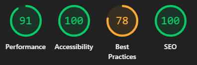

# Testing

Return to the [README.md](README.md) file.

## CONTENTS

- [AUTOMATED TESTING](#automated-testing)
  - [HTML](#html)
  - [CSS](#css)
  - [JS and jQuery](#js-and-jquery)
  - [Python](#python)
  - [Lighthouse](#lighthouse)
- [MANUAL TESTING](#manual-testing)
  - [Responsiveness](#responsiveness)
  - [Defensive Programming](#defensive-programming)
  - [User Story Testing](#user-story-testing)
- [SOLVED BUGS](#solved-bugs)

## AUTOMATED TESTING

### HTML

The recommended [HTML W3C Validator](https://validator.w3.org) was used to validate all HTML files.
The 404 page was tested by direct input because the validator received a 404 error.

| Page             | Pass / Error    | Notes          |
| ---------------- | --------------- |--------------- |
| Home             | Pass: No Errors |                |
| Products         | Pass: No Errors |                |
| Product-Detail   | Pass: No Errors |                |
| Add Product      | Error           | "Duplicate attribute id" from page source, but not shown in devtools html or vscode | 
| Edit Product     | Error           | "The value of the for attribute of the label element must be the ID of a non-hidden form control" Label is only shown when form control is shown. |
| Profile          | Pass: No Errors |
| Enquiry          | Pass: No Errors |
| Privacy Policy   | Pass: No Errors |
| Checkout         | Pass: No Errors |
| Checkout Success | Pass: No Errors |
| Bag              | Pass: No Errors |
| 404              | Pass: No Errors |
| 500              | Pass: No Errors |

### CSS

The recommended [CSS Jigsaw Validator](https://jigsaw.w3.org/css-validator) was used to validate my CSS file.

| Page         | Notes           |
| --------     | --------------- |
| base.css     | Pass: No Errors |
| profile.css  | Pass: No Errors |
| checkout.css | Pass: No Errors |

### JS and jQuery

jQuery was validated using [jQuery Validator](https://www.utilities-online.info/jquery-validator).

| Page                  | Notes           |
| --------              | --------------- |
| checkout.html         | Pass: No Errors |
| privacy_policy.html   | Pass: No Errors |
| bag.html              | Pass: No Errors |
| products.html         | Pass: No Errors |
| add_product.html      | Pass: No Errors |
| edit_product.html     | Pass: No Errors |
| product_detail.html   | Pass: No Errors |
| profile.html          | Pass: No Errors |

### Python

The recommended [PEP8 CI Python Linter](https://pep8ci.herokuapp.com) was used to validate all of my Python files.
The only errors returned were 'line too long' errors which have been excluded from the notes in below tables.

#### Validation For The_Wickery App

| File        | Notes           |
| ----------- | --------------- |
| settings.py | Pass: No Errors |
| urls.py     | Pass: No Errors |

#### Validation For Home App

| File     | Notes           |
| -------- | --------------- |
| urls.py  | Pass: No Errors |
| views.py | Pass: No Errors |

#### Validation For Bag App

| File          | Notes           |
| ---------     | --------------- |
| urls.py       | Pass: No Errors |
| views.py      | Pass: No Errors |
| contexts.py   | Pass: No Errors |

#### Validation For Checkout App

| File                  | Notes           |
| ---------             | --------------- |
| forms.py              | Pass: No Errors |
| models.py             | Pass: No Errors |
| signals.py            | Pass: No Errors |
| urls.py               | Pass: No Errors |
| views.py              | Pass: No Errors |
| webhook_handler.py    | Pass: No Errors |
| webhooks.py           | Pass: No Errors |

#### Validation For Enquiries App

| File          | Notes           |
| ---------     | --------------- |
| urls.py       | Pass: No Errors |
| views.py      | Pass: No Errors |
| forms.py      | Pass: No Errors |
| models.py     | Pass: No Errors |

#### Validation For Products App

| File          | Notes           |
| ---------     | --------------- |
| urls.py       | Pass: No Errors |
| views.py      | Pass: No Errors |
| forms.py      | Pass: No Errors |
| models.py     | Pass: No Errors |
| widgets.py    | Pass: No Errors |

#### Validation For Profiles App

| File          | Notes           |
| ---------     | --------------- |
| urls.py       | Pass: No Errors |
| views.py      | Pass: No Errors |
| forms.py      | Pass: No Errors |
| models.py     | Pass: No Errors |

### Lighthouse

All pages were checked with lighthouse to identify any issues.
Best Practices is impacted by the stripe cookie which lighthouse doesn't seem to like.

| Page              | Screenshot                                                                        |
| --------------    | ----------------------------------------------------------------------------------|
| Home              |                |
| Products          |            |
| Product Detail    |      |
| Add Product       |         |
| Edit Product      |        |
| Bag               |                 |
| Checkout          |            |
| Checkout Success  |    |
| Profile           |             |
| Enquiries         |           |
| Privacy Policy    |      |
| Login             |               |
| Sign Up           |             |
| Logout            |              |

## MANUAL TESTING

### Responsiveness

Full responsive testing was performed on mobile, tablet, and desktop following devices:

| Page              | Size      | Screenshot                                                                            |
| -----------       | -------   | ----------------------------------------------------------------------------------    |
| Home              | Desktop   |              |
| Home              | Tablet    |                |
| Home              | Mobile    |                |
| Products          | Desktop   |          |
| Products          | Tablet    |            |
| Products          | Mobile    |            |
| Product Detail    | Desktop   |    |
| Product Detail    | Tablet    |      |
| Product Detail    | Mobile    |      |
| Add Product       | Desktop   |       |
| Add Product       | Tablet    |         |
| Add Product       | Mobile    |         |
| Edit Product      | Desktop   |      |
| Edit Product      | Tablet    |        |
| Edit Product      | Mobile    |        |
| Checkout          | Desktop   |          |
| Checkout          | Tablet    |            |
| Checkout          | Mobile    |            |
| Checkout Success  | Desktop   |   |
| Checkout Success  | Tablet    |    |
| Checkout Success  | Mobile    |    |
| Enquiries         | Desktop   |         |
| Enquiries         | Tablet    |           |
| Enquiries         | Mobile    |           |
| Privacy Policy    | Desktop   |            |
| Privacy Policy    | Tablet    |             |
| Privacy Policy    | Mobile    |              |
| Bag               | Desktop   |               |
| Bag               | Tablet    |                 |
| Bag               | Mobile    |                 |
| Login             | Desktop   |             |
| Login             | Tablet    |               |
| Login             | Mobile    |               |
| Sign Up           | Desktop   |           |
| Sign Up           | Tablet    |             |
| Sign Up           | Mobile    |             |
| Logout            | Desktop   |            |
| Logout            | Tablet    |              |
| Logout            | Mobile    |              |
| 404               | Desktop   |               |
| 404               | Tablet    |                 |
| 404               | Mobile    |                 |

